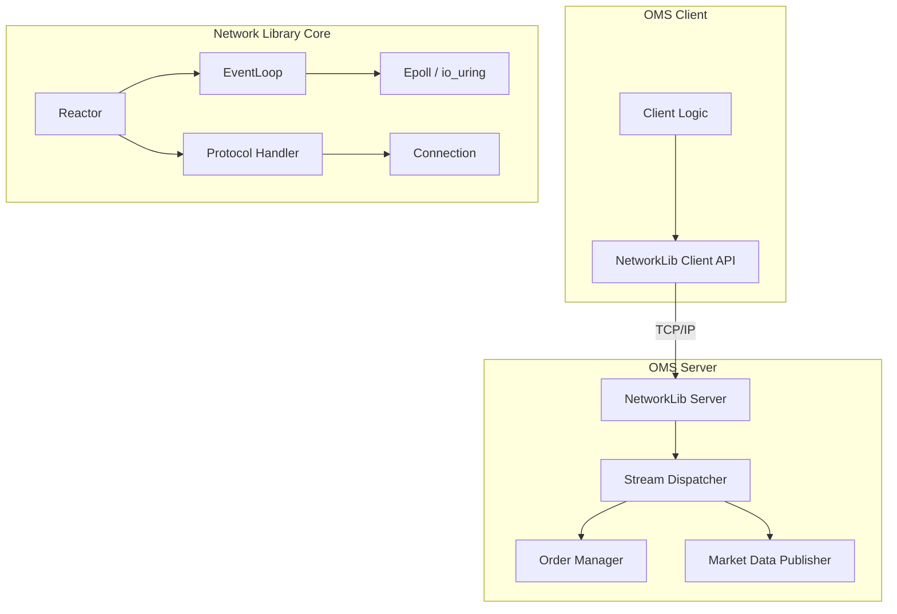
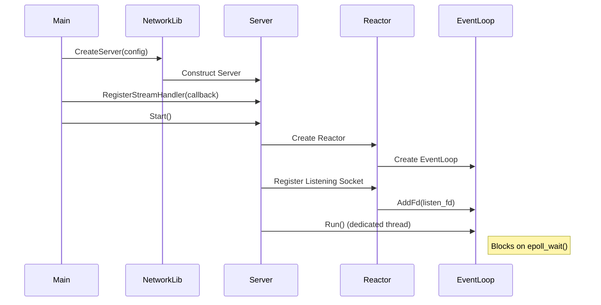
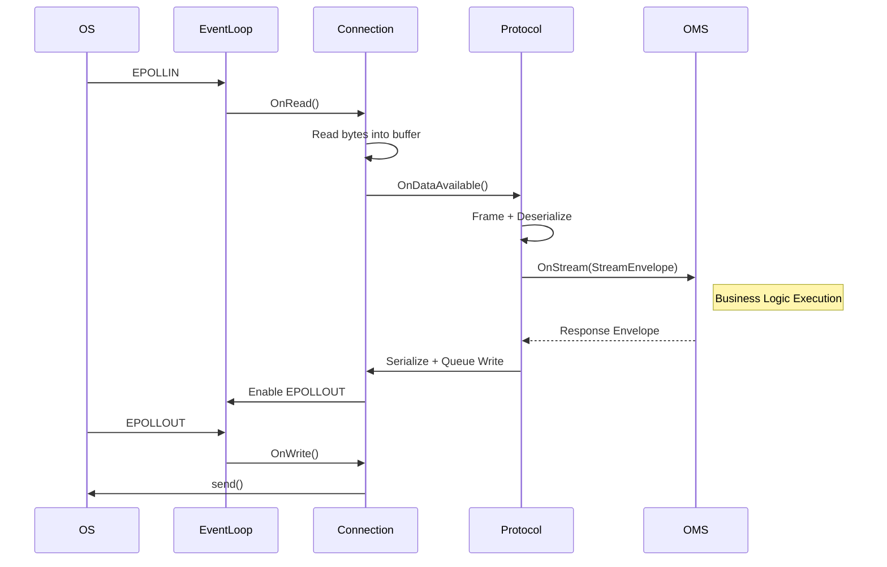

# Technical Architecture

This document provides a **revised and corrected technical architecture** for the **Network Library** and the **Order Management System (OMS)**. The focus is on clarity, correctness, and production-grade design consistency.

---

## 1. High-Level Design (HLD)

The system follows a **Layered Architecture** combined with an **Event-Driven, Non-Blocking I/O model**. The design is optimized for **low latency**, **high throughput**, and **scalability**.

### 1.1 Architectural Layers

1. **Application Layer (OMS)**

   - Contains domain and business logic:

     - Order Management
     - Market Data Processing

   - Interacts with the Network Library via a **clean, transport-agnostic API**.
   - Fully decoupled from networking concerns.

2. **Protocol Layer**

   - Responsible for:

     - Message framing
     - Serialization / deserialization (Protobuf)
     - Protocol-specific logic (TCP today, HTTP/WebSocket in future)

   - Converts raw byte streams into a unified `StreamEnvelope` abstraction.

3. **Core Network Layer**

   - Manages:

     - Connections
     - Buffers
     - Event dispatching

   - Implements the **Reactor Pattern**.

4. **OS I/O Layer**

   - Uses Linux non-blocking I/O mechanisms:

     - `epoll` (default)
     - `io_uring` (experimental / pluggable)

   - Provides high concurrency with minimal thread usage.

---

### 1.2 System Diagram

---

## 2. Low-Level Design (LLD)

### 2.1 Reactor Pattern

The **Reactor** is the central coordination component of the Network Library.

**Responsibilities**:

- Owns the `EventLoop`
- Registers file descriptors
- Dispatches I/O events to appropriate handlers

**Operational Flow**:

1. Server socket is registered with the `EventLoop`.
2. `EPOLLIN` on the listening socket triggers `accept()`.
3. A new `Connection` object is created.
4. The connection socket is registered for read/write events.
5. Incoming data events are forwarded to the `ProtocolHandler`.

This design allows **thousands of concurrent connections** using a small number of threads.

---

### 2.2 Event Loop (`EventLoop`)

The `EventLoop` abstracts OS-level polling and task execution.

**Key Components**:

- **Poller**:

  - `epoll` (production default)
  - `io_uring` (optional, experimental)

- **Task Queue**:

  - Thread-safe queue (`pending_tasks_`)
  - Allows other threads to schedule work safely

- **Wakeup Mechanism**:

  - Uses `eventfd` to wake `epoll_wait()` when tasks are enqueued

**Guarantees**:

- All I/O callbacks run on the event loop thread
- No blocking operations inside the loop

---

### 2.3 Connection (`Connection`)

Represents a single TCP connection.

**Responsibilities**:

- Owns read/write buffers
- Performs non-blocking `read()` / `write()`
- Manages partial writes
- Enables / disables `EPOLLOUT` dynamically

The `Connection` object does **not** understand message boundaries—this is delegated to the protocol layer.

---

### 2.4 Protocol Handling (`ProtocolHandler`)

The protocol layer converts byte streams into application-level messages.

**Responsibilities**:

- Read raw bytes from `Connection`
- Perform message framing
- Deserialize Protobuf messages
- Emit fully-formed `StreamEnvelope` objects

**Implementations**:

- `TcpProtocolHandler`
- (Future) `HttpProtocolHandler`
- (Future) `WebSocketProtocolHandler`

This design ensures **transport independence** for the OMS.

---

### 2.5 Unified Messaging (`StreamEnvelope`)

All application messages are wrapped inside a Protobuf-defined `StreamEnvelope`.

**Benefits**:

- Transport-agnostic messaging
- Built-in request/response correlation
- Tracing and observability support
- Metadata extensibility

**Application Contract**:

- OMS code only consumes and produces `StreamEnvelope`
- No dependency on TCP, HTTP, or WebSocket semantics

---

## 3. Component Interactions

### 3.1 Server Startup Sequence

---

### 3.2 Message Processing Flow

---

## 4. Technology Decisions

- **C++20**

  - Smart pointers, atomics, coroutines (future), lambdas

- **epoll**

  - Proven, scalable Linux event notification mechanism

- **Protocol Buffers**

  - Compact binary format
  - Backward/forward schema compatibility

- **CMake**

  - Cross-platform, reproducible builds

---

## 5. Scalability & Performance Considerations

- **Non-Blocking I/O**

  - No thread-per-connection model

- **Thread Safety**

  - Shared components guarded via mutexes / atomics
  - EventLoop remains single-threaded

- **Efficient Buffer Management**

  - Reusable buffers / object pools
  - Minimal heap allocations

- **Backpressure Handling**

  - Write buffers with high-water marks
  - Controlled `EPOLLOUT` registration

---

## 6. Summary

This architecture provides:

- Clear separation of concerns
- Transport-agnostic application logic
- High scalability with predictable latency
- A solid foundation for future protocols and observability features

The Network Library acts as a **production-grade, reusable networking core**, while OMS remains focused purely on business logic.
