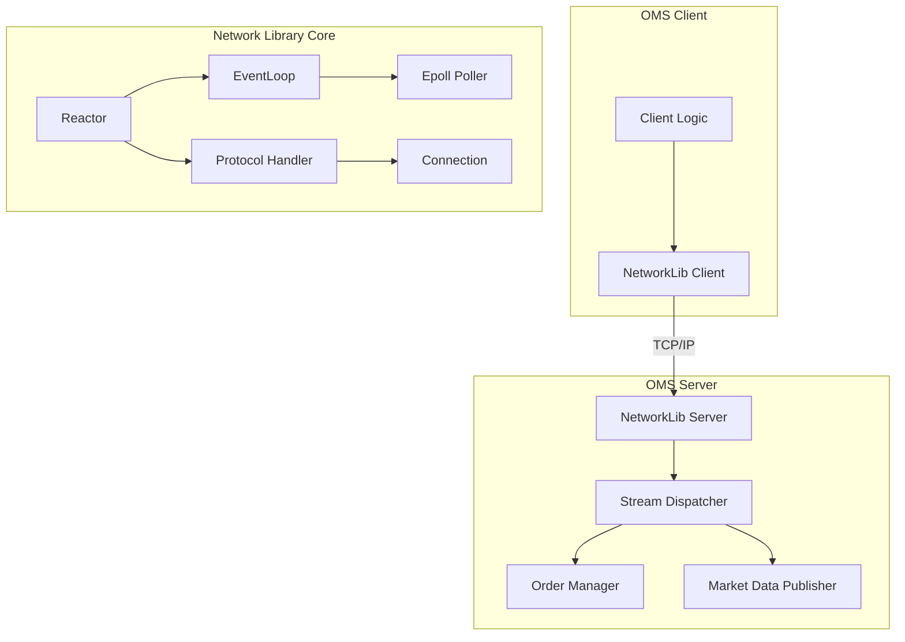

# Technical Architecture

This document provides a detailed technical analysis of the Network Library and the Order Management System (OMS).

## High-Level Design (HLD)

The system follows a **Layered Architecture** combined with an **Event-Driven** model.

### Architectural Layers

1.  **Application Layer (OMS)**: Contains business logic (Order Management, Market Data). It interacts with the network layer via a simplified API.
2.  **Protocol Layer**: Handles message framing, serialization (Protobuf), and protocol-specific logic (TCP, HTTP). It standardizes all communication into `StreamEnvelope` objects.
3.  **Core Network Layer**: Manages connections, buffers, and event dispatching. Implements the **Reactor Pattern**.
4.  **OS I/O Layer**: Uses non-blocking I/O mechanisms (`epoll` on Linux) to handle high concurrency.

### System Diagram

## Low-Level Design (LLD)

### 1. The Reactor Pattern

The core of the library is the `Reactor` class. It allows the server to handle multiple concurrent connections using a single (or few) threads.

*   **Role**: Coordinates I/O events.
*   **Mechanism**:
    1.  Registers the server socket with the `EventLoop`.
    2.  When a new connection arrives (`EPOLLIN` on server socket), it accepts the connection.
    3.  Creates a `Connection` object and registers it with the `EventLoop`.
    4.  When data arrives on a connection, it invokes the `ProtocolHandler`.

### 2. Event Loop (`EventLoop`)

The `EventLoop` wraps the OS polling mechanism.

*   **Poller**: Uses `epoll` (default) or `io_uring` (experimental).
*   **Task Queue**: Maintains a thread-safe queue (`pending_tasks_`) allowing other threads to schedule tasks on the loop (e.g., sending data).
*   **Wakeup**: Uses `eventfd` to wake up the poller when a new task is added.

### 3. Protocol Handling (`ProtocolHandler`)

Abstracts the underlying transport protocol.

*   **Responsibility**:
    *   Reading raw bytes from `Connection`.
    *   Parsing bytes into logical messages (Framing).
    *   Deserializing into `StreamEnvelope`.
    *   Invoking the application's callback.
*   **Implementations**:
    *   `TcpHandler`: Standard streaming over TCP.
    *   (Future) `HttpHandler`, `WebsocketHandler`.

### 4. Unified Messaging (`StreamEnvelope`)

To decouple the network transport from the business logic, all messages are wrapped in a `StreamEnvelope` protobuf message.

*   **Application View**: The application only deals with `StreamEnvelope`. It doesn't care if the underlying transport is TCP or WebSocket.
*   **Features**: Supports request-response correlation, tracing, and metadata.

## Component Interactions

### Server Startup Sequence

1.  `NetworkLib::CreateServer()` parses config.
2.  `Server` instance created.
3.  `Server::Start()` initializes `Reactor` and `EventLoop`.
4.  `Reactor::RegisterServer()` binds the listening port.
5.  `Server` thread starts running `EventLoop::Run()`.

### Message Processing Flow

1.  **I/O Event**: `EpollPoller` detects data on a client socket.
2.  **Dispatch**: `EventLoop` calls `Connection::OnRead()`.
3.  **Protocol**: `ProtocolHandler` reads bytes, constructs `StreamEnvelope`.
4.  **Callback**: `ProtocolHandler` calls the registered `StreamHandler` (in `oms_server/main.cpp`).
5.  **Logic**: `OrderManager` processes the order.
6.  **Response**: `OrderManager` returns a response `StreamEnvelope`.
7.  **Write**: Response is serialized and written to the `Connection` buffer.
8.  **Output**: `EventLoop` handles `EPOLLOUT` to send data.

## Technology Decisions

*   **C++20**: Used for high performance and modern language features (smart pointers, lambda, concurrency).
*   **Epoll**: chosen as the industry standard for high-performance Linux networking.
*   **Protobuf**: Compact binary format, schema evolution support, and fast serialization.
*   **CMake**: Standard cross-platform build system.

## Scalability Considerations

*   **Non-Blocking I/O**: Allows handling thousands of idle connections with minimal overhead.
*   **Thread Safety**: Critical components (`OrderManager`, `EventLoop` task queue) use mutexes/locks.
*   **Buffer Management**: Uses `ObjectPool` (implied by headers) or efficient buffer management to reduce allocation churn.
