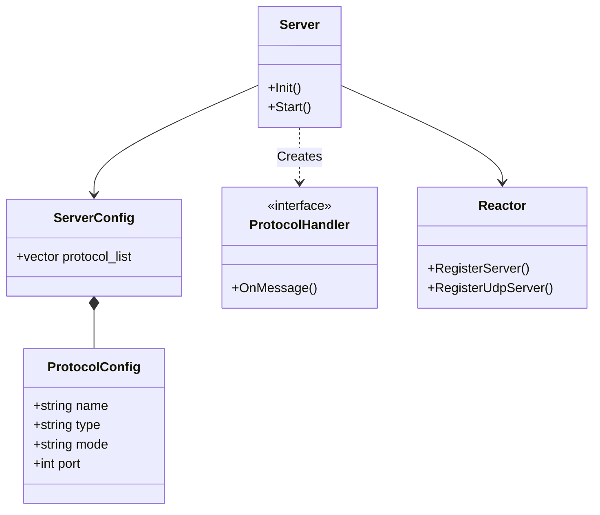
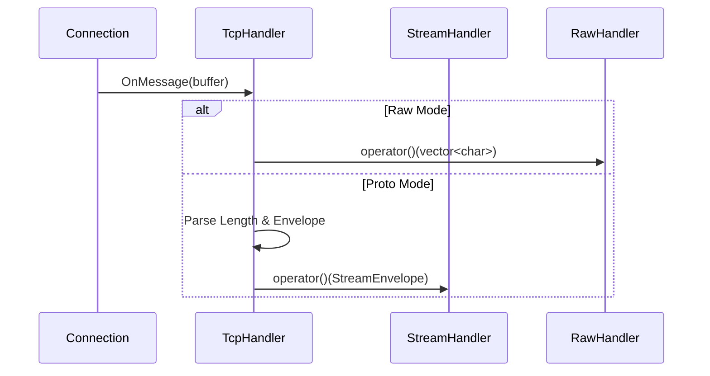

# Super-Server and Super-Client Architecture

This document describes the architecture for the Unified Reference Server ("Super-Server") and Client ("Super-Client").

## 1. Overview
The Super-Server and Super-Client are designed to demonstrate the full capabilities of the `lib_network` library, particularly:
*   **Multi-Protocol Support:** Running TCP, UDP, HTTP, gRPC, WebSocket simultaneously.
*   **Raw vs. Proto Mode:** Handling raw byte streams vs. structured `StreamEnvelope` Protobuf messages.
*   **Configuration-Driven:** Fully dynamic behavior based on YAML configuration.

## 2. Super-Server Architecture

### 2.1 Unified Server Model
The core `Server` class in `lib_network` has been enhanced to support a list of protocols.



### 2.2 Data Flow (Raw vs Proto)
The system now supports two modes of operation for data handling:

1.  **Proto Mode (Default):**
    *   Data is framed (e.g., 4-byte length prefix for TCP).
    *   Payload is deserialized into `StreamEnvelope`.
    *   Passed to `StreamHandler`.

2.  **Raw Mode:**
    *   Raw bytes are passed directly to `RawHandler`.
    *   Useful for implementing custom protocols or testing low-level connectivity.



## 3. Super-Client Architecture

### 3.1 Scenario Engine
The Super-Client uses a scenario-based approach to validation.

```yaml
scenarios:
  - name: "Raw TCP Echo"
    type: "tcp"
    mode: "raw"
    target: "127.0.0.1:9001"
    steps:
      - action: connect
      - action: send
        data: "Hello"
      - action: expect
        data: "Hello"
```

### 3.2 Unified Client
The `Client` class wraps `IClientProtocol` strategies but also allows direct raw access.

*   **Connect:** Establishes connection using the specified protocol type.
*   **Send:** Sends either `std::string` (Raw) or `StreamEnvelope` (Proto).
*   **Receive:** Dispatches to `RawMessageHandler` or `MessageHandler`.

## 4. Directory Structure
*   `apps/super_server/`: Server implementation and config.
*   `apps/super_client/`: Client implementation and scenarios.
*   `lib_network/`: Core library (updated with Raw/Multi-Protocol support).
