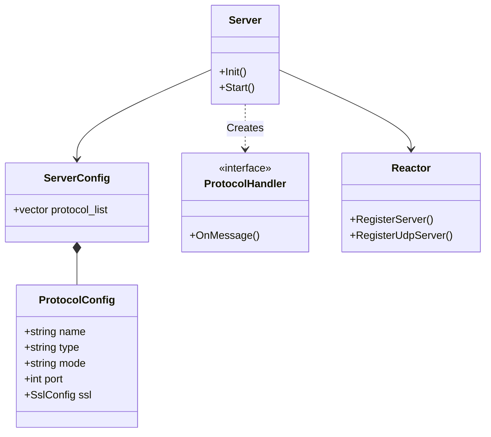

# Super-Server and Super-Client Architecture

This document describes the architecture for the Universal Reference Server ("Super-Server") and Client ("Super-Client").

## 1. Overview
The Super-Server and Super-Client are designed to demonstrate the full capabilities of the `lib_network` library, particularly:
*   **Multi-Protocol Support:** Running TCP, UDP, HTTP, gRPC, RPC, WebSocket, and QUIC simultaneously.
*   **Raw vs. Proto Mode:** Handling raw byte streams vs. structured `StreamEnvelope` Protobuf messages.
*   **Secure vs. Non-Secure:** TLS/SSL support for TCP-based protocols.
*   **Configuration-Driven:** Fully dynamic behavior based on YAML configuration.

## 2. Super-Server Architecture

### 2.1 Unified Server Model
The core `Server` class in `lib_network` supports a list of protocols defined in `server_config.yaml`.



### 2.2 Protocols
*   **TCP/UDP:** Basic transport with Raw (echo) or Proto (StreamEnvelope) handlers.
*   **HTTP/WebSocket:** Standard handlers (Basic 1.1 / WS upgrade).
*   **gRPC/RPC:** Advanced handlers using HTTP/2 framing (gRPC) or length-prefixed framing (RPC).
*   **QUIC:** Experimental UDP-based handler.

## 3. Super-Client Architecture

### 3.1 Scenario Engine
The Super-Client uses a scenario-based approach to validation (`scenarios.yaml`).

```yaml
scenarios:
  - name: "Raw TCP Echo"
    type: "tcp"
    mode: "raw"
    target: "127.0.0.1:9001"
    steps:
      - action: connect
      - action: send
        data: "Hello"
      - action: expect
        data: "Hello"
```

### 3.2 Unified Client
The `Client` class dynamically selects `SOCK_STREAM` (TCP) or `SOCK_DGRAM` (UDP/QUIC) and initializes the appropriate `ClientProtocol` strategy (Http, Grpc, Tcp, etc.).

## 4. Test Suite & Audit
The `scripts/audit/` directory contains tools for automated verification:
*   **Unit Tests:** CTest.
*   **Integration Tests:** Super-Client scenarios.
*   **Load Tests:** Concurrent client benchmark (`run_load_test.py`).
*   **Reporting:** Generates `audit_report.md`.

## 5. Directory Structure
*   `apps/super_server/`: Server implementation and config.
*   `apps/super_client/`: Client implementation and scenarios.
*   `lib_network/`: Core library.
*   `scripts/audit/`: Audit tools.
*   `scripts/benchmark/`: Load testing tools.
